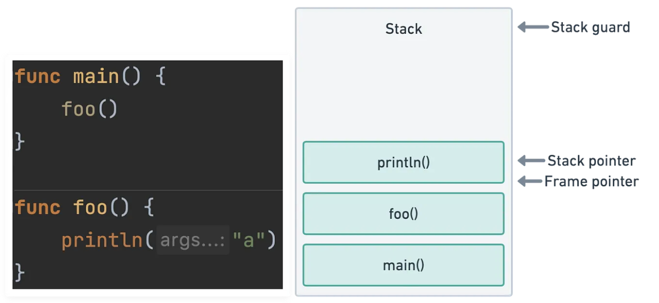
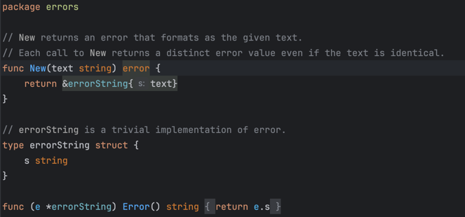
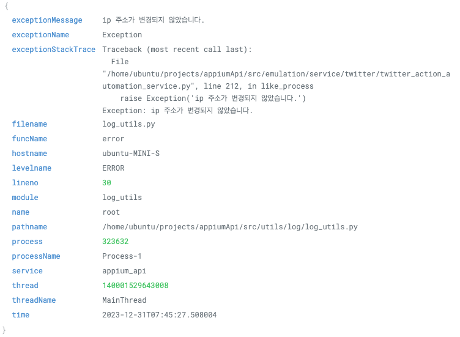
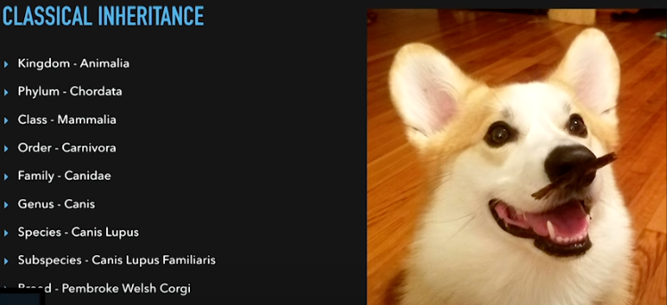
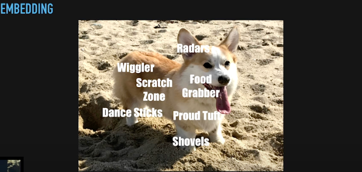

# GolangGuide

## compile, run
* ### Golang is built for simple yet fast compile and executions.   
  * If you have experience with compiling with python virtual environments with requirements.txt or java gradle / maven, 
  you most definately know how complicated and hard it is just to execute a file in a server.


* ### Advantages of golang in aspects of compile / run
  * No language needs to be installed to execute.
  * The result file is a simple executable.
  * simple package management files with .mod files.
  * Can be configured to be built for different OS and CPU architecture.


* ### CMD
  * ### modules
    * #### Init
      * ```shell
        go mod init moduleName
        ```
      * this command creates a go.mod file.   
        The go.mod file contains the module name, dependencies and versions.
    * #### Add dependency
      * ```shell
        go get github.com/pkg/errors
        ```
      * If you run `go get`, this code creates a package in the `go env GOPATH` directory.
        ```shell
        # chekc this path if the package is installed
        go env GOPATH
        ```
      * The go.sum file includes the hash information of the dependency to match the exact version, branch, content.
      * You can also use `go get` to change the version of the used dependency.
        ```shell
        go get github.com/pkg/errors@v0.8.1
        ```
    * #### List dependency
      * ```shell
        go list -m all
        ```
    * #### cleanup dependency
      * ```shell
        go mod tidy
        ```
        If you upgrade or downgrade by specifying the version with `go get`, the go.sum file will not remove the previous 
        version used. This command will remove the previous versions and unused dependencies.
  * ### compile
    * ```shell
      go build mygofile.go
      ```
  * ### compile & run
    * ```shell
      go run mygofile.go
      ```

## types
* ### Unsigned Integers
  * uint (unsigned 64bit or 32 bit by operating system) 
  * uint8 (0 ~ 255)
  * uint16 (0 ~ 65535)
  * uint32 (0 ~ 4294967295)
  * uint64 (0 ~ 18446744073709551615)
* ### Integers
  * int (64bit or 32 bit by operating system)
  * int8 (-128 ~ 127)
  * int16 (-32768 ~ 32767)
  * int32 (-2147483648 ~ 2147483647)
  * int64 (-9223372036854775808 ~ 9223372036854775807)
* ### Floats
  * float (64bit or 32 bit by operating system)
  * float32 (precision of IEEE-754 32 bit)
  * float64 (precision of  IEEE-754 64 bit)
* ### Strings
* ### Booleans
* ### Complex

## fmt
* fmt stands for "format", this package in go scans and prints I/O values by the given format.
* ### Print
  * ```go
    package main
    
    import "fmt"
    
    func main() {
      var printingValue int8 = 32
      // print
      fmt.Print(printingValue)
      // println (print with next line)
      fmt.Println(printingValue)
      // printf (print format) (mostly used)
      fmt.Printf("%d", printingValue)
    }
    ```

* ### Sprint
  * ```go
    package main
    
    import "fmt"
    
    func main() {
        var printingValue int8 = 32
    
        // sprint (set value string from print)
        var settingValue = fmt.Sprintf("%d", printingValue)
        
        fmt.Println(settingValue)
    }
    ```

* ### Scan
  * ```go
    package main
    
    import "fmt"
    
    func main() {
        // scanln (scan line)
        var input string
        fmt.Scanln(&input)
        // scanf (scan by format)
        var integerInput int64
        fmt.Scanf("%d", &integerInput)
    }
    ```

* ### formatting
  * #### value, type
    * `%v` : value
    * `%+v` : struct value with field names
    * `%T` : type
  * #### bool
    * `%t` : bool
  * #### int
    * `%b` : binary
    * `%o` : oxadecimal
    * `%d` : decimal
    * `%x` : hexadecimal
  * #### float
    * `%e` : adds the scientific notation e
    * `%f` : e is removed but lesser decimals
    * `%.2f` : %f with the precision of 0.XX, rounded
    * `%g` : e is removed, for large exponents

  * #### [fmt package for more](https://pkg.go.dev/fmt)


## pointers
* ### Memory stack in Go
  * Every function in go creates a new memory stack in use.
       
    In this memory stack, all memory usage of variables are considered "immutable".    
    They can only be accessed within the stack and cannot be modified from outside the scope.
    ```go
    package main

    import "fmt"
  
    func main() {
      var IntegerValue int64 = 256
    
      WithoutPointer(IntegerValue)
      fmt.Println(IntegerValue)
    }
    func WithoutPointer(IntegerValue int64) {
      IntegerValue += 10
    }
    ```
    This code will create 2 memory stacks. main and WithoutPointer.   
    Modifying the value of IntegerValue in `WithoutPointer` will not modify the value in `main`.

    ```go
    package main

    import "fmt"
  
    func main() {
      var IntegerValue int64 = 256
    
      WithPointer(&IntegerValue)
      fmt.Println(IntegerValue)
    }
    func WithPointer(IntegerValue *int64) {
      *IntegerValue += 10
    }
    ```
    
    However if you send the variable to the function as a pointer, you can modify memory within different stacks.   
    This is because the `WithPointer` memory stack is given the address of `IntegerValue`.

* ### Usage
  * ### `&Variable`   
    `&` returns the address of of the variables memory. (ex: `0x14000110018`)
  * ### `*VariableMemoryAddress`   
    `*` is used to modify, change or read the variable of the given address.   
    ```go
    var Variable int64 = 0
    var VariableMemoryAddress = &Variable
    *VariableMemoryAddress += 1 
    ```
  * ### `*int64`   
    The `*` sign is also used to tell that the type itself is a pointer by adding it in front of a type.
    ```go
    var Variable int64 = 0
	var VariableMemoryAddress *int64 = &Variable
    ```
    
* ### [Great explenation of pointers in go](https://www.youtube.com/watch?v=sTFJtxJXkaY&t=632s)

## loops
* golang has a similar but different way of defining loops.   
* ### No `while`
  * Golang `for` keyword replaces the `while` keyword unlike most programming languages.   
    ```go
    // while (condition)
    for variable > 10 {
    }
    // while true
    for true {
    }
    ```
* ### Unified `foreach`
  * Golang has a unified method for looping elements from iterations compared to other languages.   
    #### Go iterating array
    ```go
    for i, element := range array {
    }
    ``` 
    #### Go iterate map   
    ```go
    for key, value := range map {
    }
    ```

    #### Java iterate array
    ```
    // available in java 5
    for (Type element : array) {
    }
    ```
    
    #### Java iterate map
    ```
    // 1. using map entryset
    for (Map.Entry<String, Integer> entry : map.entrySet()) {
        entry.getKey();
        entry.getValue();
    }
    
    // 2. using map iterator
    Iterator<Integer> iterator = map.values().iterator();
    while (iterator.hasNext()) {
        Integer value = iterator.next();
    }
    
    // 3. using map foreach
    map.forEach((key, value) -> ...);
    ```   
    as you can see, Golang does have a more unified and simple method compared to java.

## Error Handling
* golang has quite a unique way of handling errors compared to other languages.
* ### panic
  * Conventional programming languages throw exceptions, in Go, we throw panics.   
    But as funny as it seems, we cannot catch a panic like a try catch method.
  * #### The characteristics of panic
    1. The goroutines where the panic occurred terminates
    2. It does not affect the execution of other goroutines
    3. It is a unrecoverable state and terminate immediately
* ### handling panic with `defer` and `recover`
  * I wouldn't call this "handling" because `defer` will not stop the termination and keep the goroutine running. 
    But still we should be able to log the panic and change our code to return it as a custom error afterwards.      
    ```go
    func main() {
        defer func() {
            if r := recover(); r != nil {
                fmt.Println("defer check for from panic:", r)
            }
        }()

        panic("panic attack")
    }
    ```   
    Here, the `r:=recover();` returns the string "panic attack".   
    Remember that panic has a parameter of type `any`, so `recover` returns whatever type that is given.
* ### handling goroutines panic with `defer`
  * When we use goroutines, we use `WaitGroup` in order to wait for the routine to be finished.    
    If the routine panics without `wg.Done()`, the program will wait forever. In order to block such behaviour we must `defer`.
  * ```go
    var wg sync.WaitGroup
  
    func waitRoutine() {
      defer wg.Done()
      panic("panic attack")
    }
  
    func main() {
      wg.Add(1)
      go waitRoutine()
      wg.Wait()
    }
    ```
* ### errors
  * If you check the `errors.go` package, you can see that it is shockingly simple.   
    But because of it's "short" code, it does lack some functionality that other languages offer as a given.   
    One of the features that lack I find annoying is getting the stack trace.
    
  * #### The lack of information in errors   
    In java, the exception class itself has a `printStackTrace`.   
    ```
    try {
        throw new RuntimeException("oops, error.");
    } catch (RuntimeException e) {
        e.printStackTrace();
    }
    ```
    Creating custom errors might me sufficient enough, but if you use that custom error raised in two different places, how would 
    you debug just using a the string message?   
    So our best bet would be to create a custom error struct that contains a stack trace.
    ```go
    package main
    
    import (
        "fmt"
        "runtime/debug"
    )
    
    type CustomError struct {
        errorMessage string
        stack        string
    }
    
    func (e CustomError) Error() string {
        return e.errorMessage
    }
    
    func NewCustomError(message string) CustomError {
        return CustomError{errorMessage: message, stack: string(debug.Stack())}
    }
    
    func main() {
        err := NewCustomError("oops, error.")
        fmt.Println(err.stack)
    }
    ```
    If you use custom logging services like datadog or logstash, you should customize your error struct to be as specific as possible
    , such as the name of the gorutine `runtime.GoID()`, the current executing code file with `runtime.Caller(1)` etc.   
    <br/>
    Example of error logging in datadog
    
    
## Goroutines
* "Goroutines are lightweight thread managed by the Go runtime." - [official go.dev](https://go.dev/tour/concurrency/1#:~:text=A%20goroutine%20is%20a%20lightweight%20thread%20managed%20by%20the%20Go%20runtime.&text=The%20evaluation%20of%20f%20%2C%20x,shared%20memory%20must%20be%20synchronized.)   
  In most programming languages, you have the option to create a thread or process for concurrency.   
  In Go, we can only create goroutines.   
* ### WaitGroup
  ```go
  package main
  
  import (
    "sync"
    "time"
  )
  
  var wg sync.WaitGroup
  
  func waitRoutine() {
    defer wg.Done()
    time.Sleep(1000)
  }
  
  func main() {
   for i := 0; i < 1000; i++ {
      wg.Add(1)
      go waitRoutine()
   }
   wg.Wait()
  }
  ```
  WaitGroup is a tool in the "sync" package in order to wait for goroutines.   
  <br/>
  * #### Functionality
    * #### `wg.Add(delta)`   
      this function adds the parameter `delta` in most case 1, meaning as a incrementation of goroutines to be waited.   
      ```go
      func main() {
        wg.Add(1000)
        for i := 0; i < 1000; i++ {
            // wg.Add(1)
            go waitRoutine()
        }
        wg.Wait()
      }
      ```
      This code has no functional difference with the previous code.
    * #### `defer wg.Done()`   
      This tells the `wg` waitGroup that 1 goroutine is finished.   
    * #### `wg.Wait()`
      This waits until enough `wg.Done()` is called as much as the `delta` added by `wg.Add()`
* ### Channels
* ```go
  package main

  import (
    "fmt"
  )
  
  func sendData(ch chan int) {
    for i := 0; i < 5; i++ {
        ch <- i
    }
    close(ch)
  }
  
  func main() {
    ch := make(chan int)
    go sendData(ch)

    for {
        data, running := <-ch
        if !running {
            break
        }
        fmt.Println(data)
    }
  }
  ```
  In Go, waitGroups are not the only way to wait for goroutines, you can also use channels in order to receive and e wait.   
* #### Functionality
  * #### `ch := make(chan int, size)`   
    This line declares a channel variable. In order to specify a channel type, `chan int` is used.   
    You can also specify the number of how much values can be sent to this channel by `size`.
    ```go
    ch := make(chan int, 3)
    ch <- 1
    ch <- 2
    ch <- 3
    // The next send will block and result in a panic
    ch <- 4
    ```
  * #### `ch <- i`
    This line is used to send variables to the channel.   
  * #### `close(ch)`
    This line makes the `running` boolean in `data, running := <-ch` return as false.   
    Which means that the channel is closed and no longer for use.
  * #### `data, running := <-ch`
    This line is used for receiving data in the channel.   
    `data` is sent by `ch <- i`, `running` is changed to false by `close(ch)`.

## OOP? in Go
* Go is quite different than other languages even in implementing OOP.   
  Go does not have inheritance, and it has embedding.
* ### Embedding
  
  
  <br/>
  In inheritance, a dog is a mammal, which is a animal.  
  A mammal can run, and a animal can breath.  
  <br/>
  In embedding, a dog has legs, and lungs.  
  Legs can run, and lungs can breath.  
  <br/>
  [Great conference in GopherUK](https://www.youtube.com/watch?v=-LzYjMzfGDQ)
  <br/>   

* ### Promotion
  "For a value x of type T or *T where T is not a pointer or interface type, x.f denotes the field or method at the shallowest depth in T where there is such an f. If there is not exactly one f with shallowest depth, the selector expression is illegal." - [Go](https://go.dev/ref/spec)
  ```go
  package main

  import "fmt"
  
  type Depth0 struct {
    Depth1
  }
  
  type Depth1 struct {
    Depth2
    seq int
  }
  
  type Depth2 struct {
    seq int
  }
  
  func main() {
    depth := Depth0{Depth1: Depth1{seq: 1, Depth2: Depth2{seq: 2}}}
    fmt.Println(depth.seq)
  }
  ```
  The difference with java and other conventional code is that the `seq` can be accessed within of type `Depth0`.
  This is because of golang uses embedding not inheritance.   
  <br>
  If a dog has a leg, you can say that a dog can walk. : `depth.seq`  
  You can also say that the dogs right leg is walking. : `depth.Depth1.seq`   
  You can also say that the dogs left leg is walking. : `depth.Depth2.seq`   
  <br>
  Another thing to note is that the code above will return `seq` of `depth1` not `depth2`. As instructed from Go as "shallowest depth."   
  <br>
  If the `seq` is in the same depth, golang returns a compile error "ambiguous selector".
* ### Duck Typing
  "If it walks like a duck, and it quacks like a duck. It must be a duck."   
  In Go, this is allowed in interfaces, but not in structs.
  ```go
  package main

  type Duck interface {
    quack()
    walk()
  }
  
  // class to class duck typing does not work
  // type Duck struct {
  // }
  
  type Something struct {
  }
  
  func (Something) quack() {
  }
  
  func (Something) walk() {
  }
  
  func isThisADuck(duck Duck) {
  }
  
  func main() {
    something := Something{}
    isThisADuck(something)
  }
  ```
  Note that the `Duck` interface was not mentioned anywhere on class `Something`.   
  But still passes as the parameter as the interface `Duck`.
* ### Struct (Json handling)
  ```go
  package main
  import (
    "encoding/json"
    "fmt"
  )
  type Account struct {
    email    string `json:"email"`
    firstName string `json:"first_name,omitempty"`
    lastName string `json:"last_name,omitempty"`
    password string
    age      uint8  `json:"age,omitempty"`
  }
  type AccountView struct {
    Account
    password string `json:"omitempty"`
  }
  func main() {
    account := Account{
      email: "dohyung97022@gmail.com",
      password: "my super secret password"
    }

    jsonData, _ := json.Marshal(account)
    fmt.Println(jsonData)

    accountView := AccountView{Account: account}
    jsonData, _ = json.Marshal(accountView)
    fmt.Println(jsonData)
  }
  ```
  Structs are the "Class" of golang. So easy, everybody knows that.   
  So what I wanted to talk about is, handling json within Go.   
  In modern programming, we use the term `model`, `view`, `controller`, `service` to separate structures within the backend.   
  You will need to create `model` as `view(json)` and communicate with the frontend.   
  <br>
  In Go, you can use keywords such as `json`, `omitempty`.   
  The example above, `account` is set with no `firstname` `lastname` or `age`.   
  `omitempty` will remove the field that is not specified.
  ```
  {"first_name":"dohyung97022@gmail.com", "password":"my super secret password"}
  ```
  There will be situations when you need to remove the values like `password`.   
  In this case, you can use "Promotion" in order to remove unwanted json values.   
  Remember, embedding in Go always promote the "shallowest depth".
  ```
  {"first_name":"dohyung97022@gmail.com"}
  ```


TODO :   
benchmark   
https://www.youtube.com/watch?v=u6dpEuJ7tB8

test   
https://www.youtube.com/watch?v=JTLB7j8M85A